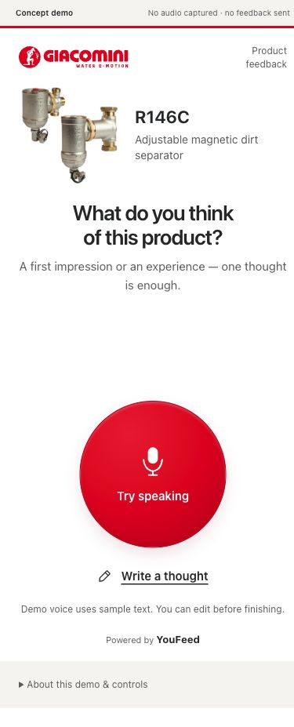
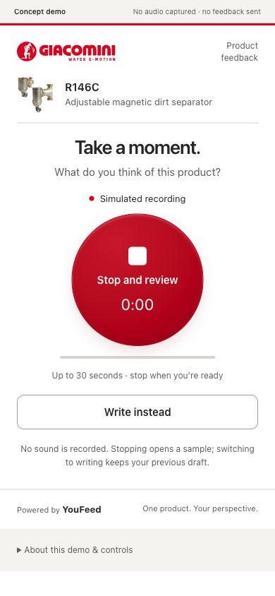
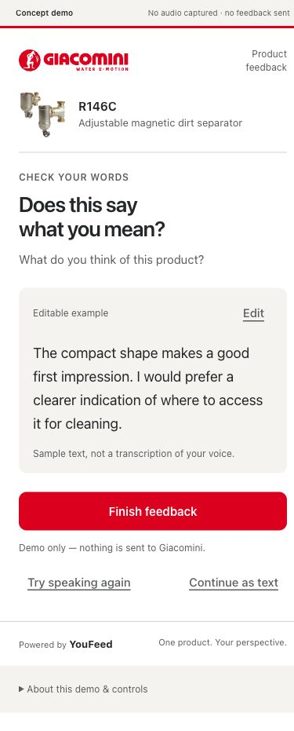
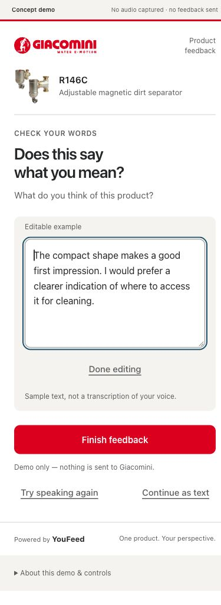
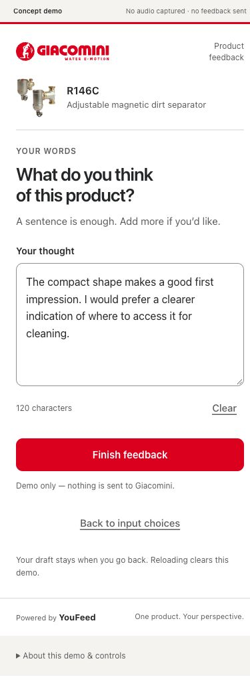
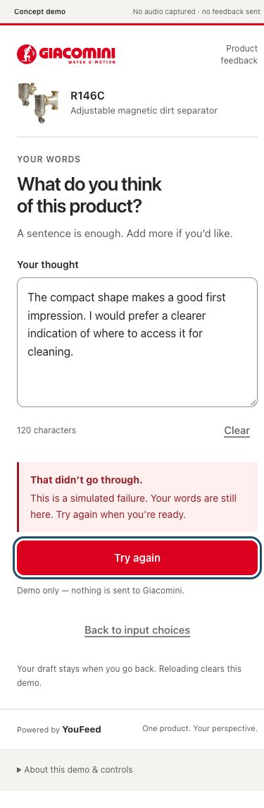
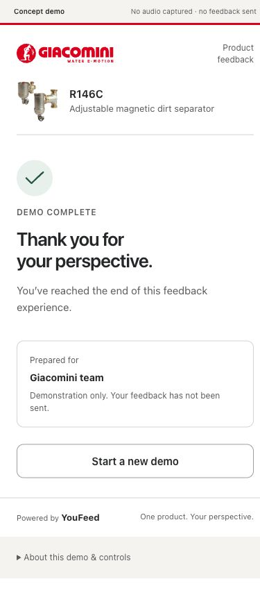
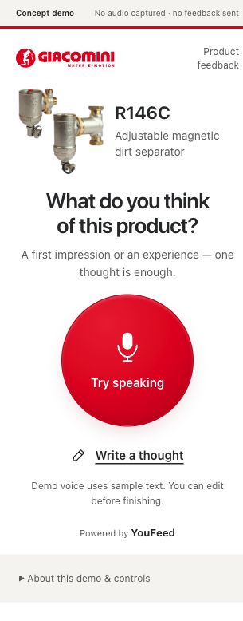

# YouFeed：统一产品设计评审与修改指南

日期：2026-10-09。交付给用户统一实施。本轮不修改产品代码。

## 结论与范围

保留产品方向和核心流程，不增加功能。当前最需要统一的是：**从识别产品到开始表达的连续性、各步骤的信息密度，以及编辑/完成动作的含义。** 不是继续换品牌、放大圆形按钮或把页面改成问卷。

定位以 [HANDOFF.md](../../HANDOFF.md) 为准：跨展会、门店等触点收集产品反馈；用户参与YouFeed和NFC物料设计，未参与InsightGPT。历史落地与当前重构分别记录，本次浏览器审查不否定历史验证，也不能证明新版效果提升。

本轮实际打开本地4173生产预览，截图并走查：首页→模拟语音→核对→编辑→转文字→模拟提交失败→重试完成；另看320×568短屏首页。主视口390×844，全页截图可能比视口更长，系统滚动条占用部分宽度；不要把导出图片高度当手机屏高。截图均在本轮采集并打开确认。

未覆盖：真实NFC触发、物理手机键盘、真实麦克风/转写/送达、InsightGPT、屏幕阅读器、全部错误分支、全浏览器矩阵。以下数值是下一轮设计起点，不是用户研究结论。

## 一、固定设计原则

1. 一次只评价一个已确定的产品，不要求先注册、选分类或回答多题。
2. 第一印象和使用经验都可以表达，不强迫用户先有使用经历，也不把问题收窄成咨询需求。
3. Giacomini负责“谁在邀请、评价什么”；圆形语音动作、内容可控与恢复规则构成YouFeed的稳定体验。
4. 语音是视觉主入口，文字同屏可发现；不要因为强调语音而把文字藏进菜单。
5. 实体触点→首页→表达→核对→完成保持连续，错误不惩罚已经输入的用户。
6. 当前演示始终明确模拟，不为截图好看隐藏事实；真实服务接入不属于本轮修图任务。

## 二、逐步评审

### 0. 实体入口：保留，尚未在本轮现场核查

NFC/二维码物料是产品体验的一部分。后续检查当年材料是否解释了“对哪个产品反馈、碰/扫之后是什么、是否可以用文字”。不要凭空新增承诺或把建议写成已经实施。无需把InsightGPT介绍搬上用户首页。

### 1. 首页：优先修改

证据：01、08。

做得好：客户、产品和开放提问清楚，产品图已足够承担识别，大圆形容易发现。

问题：390px视口中，说明与圆形之间大块空白使内容和动作脱节；320px短屏则明显紧凑，说明这种空白主要来自布局分配，不是必需内容。当前不是错误的手机尺寸，而是把剩余高度放在了任务中间。品牌/产品横排、问题居中本身并非错误，不要为统一轴线把所有文字都强行居中。

修改：产品卡、问题、输入选择组成连续内容组。取消输入选择吸收剩余高度的规则；多余空间放在任务组之后、署名之前。保留产品图约112–128px，不再继续放大；保持图片完整、不裁两种形态。产品名称最多自然排2–3行，不挤压图片。

验收：390×844与375×812下两种入口可见；320×568允许自然滚动，不能为了塞入首屏缩小文字或裁切。问题说明到圆形边缘先试28–36px，不能随屏幕增高膨胀成大片空洞。

### 2. 录音：结构可用，需和首页保持连续

证据：02。

做得好：有停止、计时、时长和文字替代，不需要用户猜如何结束。

问题：首页圆形靠下，录音圆形大幅上移；文字入口从轻链接变为大描边按钮；同时出现状态、计时、进度、时限和多段说明，信息偏多。“Take a moment”没有直接说明当前动作。

修改：共享首页/录音的主要操作区，尽量减少圆形中心位置跳动，不能为固定位置裁切长内容。圆形尺寸和触感保持一致，图标从麦克风变停止方块。保留明确模拟状态、计时和时长；进度线可删除以减少重复。文字入口采用与首页一致的轻按钮，不与停止争主次。

文案建议：标题“Voice feedback”；状态“Demo recording”；圆形“Stop & review”；时长“Up to 30 seconds”。不要在模拟模式写“We’re listening”或使用伪音量波形暗示真的在采集。

### 3. 核对：内容掌控好，操作选择重复

证据：03。

做得好：样例被标明，内容可读、可编辑，完成动作明确。

问题：同时提供Edit、Continue as text与Try speaking again；用户可能不知道“编辑”和“转文字”有什么区别。原问题、步骤标签、标题也反复解释同一任务。

推荐统一模型：**两种输入最终都是一份可编辑草稿**。语音路径进入核对页后，Edit直接编辑这份草稿；移除核对页重复的Continue as text入口，不删除或复制草稿。保留“Try voice again”为次要动作，已有内容被替换前继续确认。文字用户可在输入页直接核对并完成，不强行增加一页。

标题简化为“Review your feedback”；原问题可以保留为一行弱提示，如空间不足可省略，因为对象仍在且任务未改变。主操作始终一个。

### 4. 核对中的编辑：优先消除两级“完成”

证据：04。

问题：Done editing与Finish feedback同时可见，形成两级完成；输入框、容器内边距和长页头使页面明显增长。当前浏览器没有物理软键盘，因此不能据截图断言键盘遮挡，但布局存在需真机核查的风险。

推荐：点击Edit后就地显示输入框，实时更新草稿；保留唯一主要按钮Finish demo，可直接完成当前文本，不强制先Done editing。若保留收起动作，命名“Preview text”并降为辅助动作，不作为提交前置步骤。不可在空白或处理中提交。

### 5. 文字：流程可用，需要减轻非任务信息

证据：05。本轮从核对转入文字后120字样例保持。

问题：字数、Clear、返回入口、刷新说明与页脚使页面变长；没有字数上限时，实时计数对用户决策帮助有限。“Back to input choices”更像描述界面结构，而不是用户想做的事。

修改：保留字段标签、输入框与单一完成动作；字数计数可移除。Clear降权但保留确认；返回可用“Back”，就近短说明“Draft kept”，或在可证明不丢内容时通过状态反馈提示。不要把Back直接改成Try voice却仍返回入口：文案和动作必须一致。

输入字体至少16px、行高约1.5–1.6，初始5–6行即可；长内容与软键盘出现时可滚动到操作。不要贸然固定底部提交栏盖住输入。

### 6. 失败恢复：保留逻辑，精简说明

证据：06。本轮模拟失败后草稿保留，焦点落在Try again；重试进入完成。

修改：错误靠近主要动作，简短说明“Demo submission failed. Your feedback is kept.”，动作“Try again”。不要用换文字输入代替提交重试。语音无内容、转写失败、权限不可用等现有分支不在本轮重新逐一审查，后续修改必须回归，不能趁视觉统一移除恢复能力。

### 7. 完成：结束明确，但演示重启不应像任务下一步

证据：07。

做得好：明确说明未送达客户，避免虚假成功。

问题：感谢语、完成说明、Prepared for卡片和重新开始占据多个层级；Start a new demo是演示控制，不是访客完成后的核心需求。

修改：结果标题＋一段结果说明＋轻量重启入口即可。当前演示建议“Demo complete”与“No feedback was sent.”；接收方如保留，写“Intended recipient: Giacomini”，不暗示已进入客户平台。重启入口降权或放到演示控制中；无需伪造关闭浏览器按钮。

## 三、一次性统一的视觉与内容规则

| 项目 | 修改指南 | 不做什么 |
| --- | --- | --- |
| 页面骨架 | 客户页头→产品身份→当前任务→主要内容/动作→辅助动作→署名 | 不靠固定高度或巨大空白模拟手机 |
| 主内容宽度 | 手机左右20–24px；桌面保留约440–480px阅读列 | 桌面窄列不是手机模拟器，展示时另用设备预览 |
| 产品身份 | 首页112–128px图片；后续52–60px紧凑图；整个组合对齐内容列 | 不让后续产品栏继续占用首页级面积 |
| 圆形动作 | 约176–192px起点，窄屏约166px；同一径向明暗和按压反馈 | 不追加光晕、伪音量动画、持续呼吸动效 |
| 间距 | 标签到内容8–12px；内容组16–24px；问题到主要动作28–36px起点 | 数值是设计起点，不是所有屏幕强制像素坐标 |
| 字号 | 主标题26–30px；正文/输入16px；辅助13–14px；署名12px | 不用10px承载关键模拟说明或错误信息 |
| 主要按钮 | 每屏一个主要结果动作，触达至少48px高 | 不并列多个同权重完成动作 |
| 文字替代 | 图标/文字轻按钮，44–48px触达；各屏样式一致 | 不隐藏到菜单，不仅以颜色区分可点击 |
| 页脚 | 所有屏统一只保留Powered by YouFeed | 不让口号在后续页突然重新出现 |
| 演示说明 | 顶部清楚标识Concept demo；语音和完成处保留必要事实 | 不把详细限制在每屏重复一遍，也不全部藏起来 |
| 错误/焦点 | 可见焦点、清楚错误文字、恢复动作邻近、状态不只靠红色 | 不仅为截图移除键盘焦点或错误提示 |

建议首页文案维持“What do you think of this product?”；辅助改为“Share an impression or experience.”。不增加评分、标签或多题选择来替代开放反馈。

当前演示按钮可统一为“Try voice demo”→“Stop & review”→“Finish demo”；文字入口“Write feedback”。真实服务版本的“Start recording”/“Send feedback”只在真正接入后使用。统一文案时保留用户任务，而不是让整个页面变成技术说明。

## 四、实施顺序与验收

### P1 本轮一起改

- [ ] 首页取消动作区自动吃剩余空间，页面余白放到任务组之后。
- [ ] 首页与录音圆形尺寸/位置节奏一致，文字替代样式一致。
- [ ] 核对页去掉重复“转文字”，编辑共享同一草稿。
- [ ] 消除Done editing与Finish feedback的两级完成。
- [ ] 各屏统一辅助文案和署名，精简完成页重启入口。

### P2 同轮有余力再改

- [ ] 删除无上限的字数计数，弱化Clear。
- [ ] 精简计时/进度的重复表达，确保时限仍可理解。
- [ ] 核查弱文字、模拟说明、长产品名和错误块的实际可读性。

### 验收清单

- [ ] 375×812、390×844、430×932：任务连续、无巨大中段空洞，语音/文字容易发现。
- [ ] 320×568、横屏短视口：允许滚动，无横向溢出、无被固定按钮遮挡。
- [ ] 200%文字放大：内容按顺序流动，不靠省略号隐藏问题或错误。
- [ ] 实体iOS/Android手机键盘：输入焦点可见、完成动作可达、键盘收起后无异常空白。
- [ ] 改语音样例→编辑→返回/重新录制取消→失败重试：同一草稿保留。
- [ ] 清空、重录替换、重新开始仍需确认；空白与重复提交仍受保护。
- [ ] 键盘操作、焦点回归、减少动效偏好保留；完整读屏和对比度验收另做，不宣称本轮已通过。
- [ ] 模拟与真实送达边界在首页/语音/完成仍清楚。

## 五、不要扩展的范围

本轮不做后台、InsightGPT界面、账户、积分、评分问卷、真实AI转写和公开发布。NFC物料的既有设计与历史证据在作品集中呈现，不在本次UI修改中重新发明。所有改动是新版设计提案，不意味着历史项目没有验证。

短屏证据：

